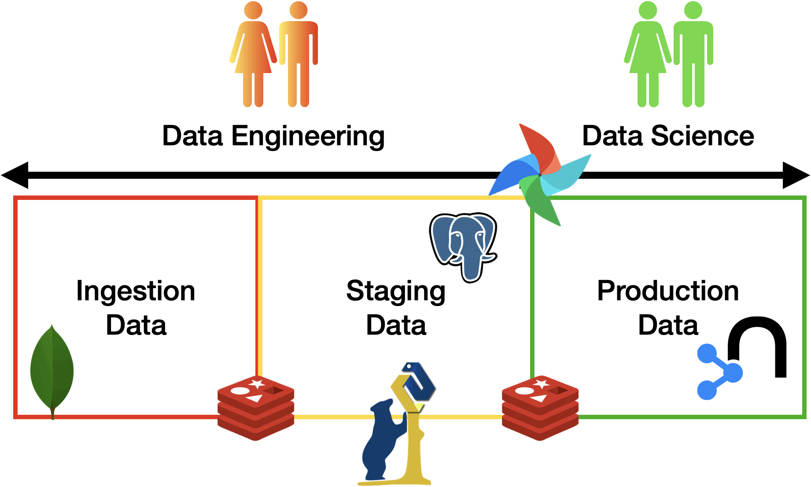

# Data engineering project
Data engineering pipeline from scratch  : ingestion, staging &amp; production.
---
Who we are?
---
Two students in data engineering course at INSA Lyon -5IF- last year of computer science engineering degree.
Pr.[ Riccardo Tommasini](https://riccardotommasini.com/), our instructor in this course gave us the opportunity to put all the skills that we were thought throughout this class.

---
What is it?
---
This is a full interactive capstone project design and build a data pipeline from scratch, using the fundamental tools of a data engineer :
> [Docker](https://www.docker.com/) 

> [Apache Airflow](https://airflow.apache.org/)

> SQL : [Postgres](https://www.postgresql.org/) 
 
> NoSQL : [MongoDB](https://www.mongodb.com/) & [Neo4j](https://neo4j.com/)

> ETL & ELT

> Wrangling : [Pandas](https://pandas.pydata.org/)

> Data warehouse & data visualization : [Grafana](https://grafana.com/)

---
To whom this project may concern?
---
This project is designed to help students in data science, AI and ML students understand the work of a data engineer,
to guide learners who want to practice their python,docker, databases, automation and visualization skills, to beginners who want to study data engineering using these materials [Data eng course](https://riccardotommasini.com/teaching/),
to IT professionals who want to know more about the dataOps world and finally to help every person in this world who is looking for a full data pipeline built from scratch step by step.

---
How are we going to design this data Pipeline?
---
Following the last task given by our professor [Riccardo Tommasini](https://riccardotommasini.com/): 
> #### The minimum number of pipelines is 3 :
> * First pipeline : responsible to bring raw data to the landing zone. Such pipeline is supposed to ingest data from the source identified at first and bring them to a transient storage.
> * Second pipeline : responsible to migrate raw data from the landing zone and move them into the staging area. In practice, the second pipeline is supposed to
>   * Clean the data according to some simple techniques saw in class 
>   * Wrangle/transform the data according to the analysis needs.
>   * Enrich the data by joining multiple datasets into a single one.
>   * Persist data for durability.
> * third/fourth pipeline : responsible to move the data from the staging zone into the production zone and trigger the update of data marts (views). 
>   * The production zone is also permanent and data shall be stored to prevent loss.
>   * Such pipeline is also responsible to launch the queries implemented according to one of the analytics languages of choice (SQL/Cypher)
>   * If you are using SQL, the final database should follow the star schema principles
>   * For the graph database instead it is sufficient to implement the queries.

for that we have chosen the subject of movie recommendation system to design its data engineering pipeline.

---

---

---
Where the data come from? and type of the data sources? 
---
Data model 
---
How to run the project?
---
Installation
---
Development 
---