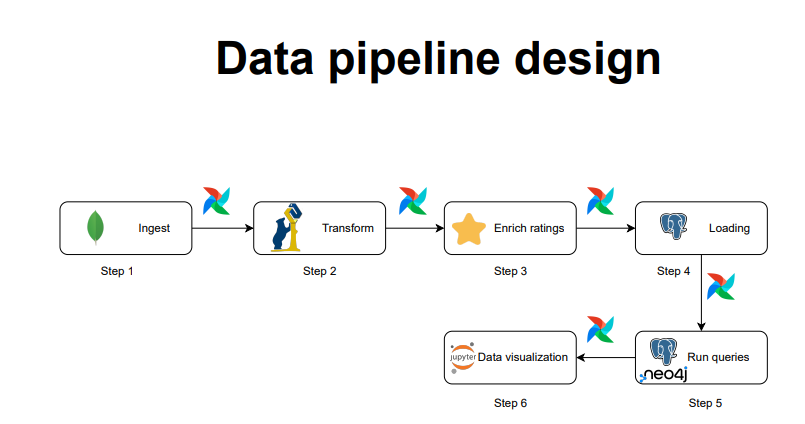

# Data engineering project
Data engineering pipeline from scratch  : ingestion, staging &amp; production.
---
Who we are?
---
Two students in data engineering course at INSA Lyon -5IF- last year of computer science engineering degree [Saad Alahyane](https://www.linkedin.com/in/saad-alahyane-5270a2228/) & [Khalil El joulali](https://www.linkedin.com/in/khalil-el-joulali-6925931b5/).
Pr.[ Riccardo Tommasini](https://riccardotommasini.com/), our instructor in this course gave us the opportunity to put all the skills that we were thought throughout this class.

---
What is it?
---
This is a full interactive capstone project design and build a data pipeline from scratch, using the fundamental tools of a data engineer :
> [Docker](https://www.docker.com/) 

> [Apache Airflow](https://airflow.apache.org/)

> SQL : [Postgres](https://www.postgresql.org/) 
 
> NoSQL : [MongoDB](https://www.mongodb.com/) & [Neo4j](https://neo4j.com/)

> ETL & ELT

> Wrangling : [Pandas](https://pandas.pydata.org/)

> Data warehouse & data visualization 

---
To whom this project may concern?
---
This project is designed to help students in data science, AI and ML students understand the work of a data engineer,
to guide learners who want to practice their python,docker, databases, automation and visualization skills, to beginners who want to study data engineering using these materials [Data eng course](https://riccardotommasini.com/teaching/),
to IT professionals who want to know more about the dataOps world and finally to help every person in this world who is looking for a full data pipeline built from scratch step by step.

---
How are we going to design this data Pipeline?
---
Following the last task given by our professor [Riccardo Tommasini](https://riccardotommasini.com/): 
> #### The minimum number of pipelines is 3 :
> * First pipeline : responsible to bring raw data to the landing zone. Such pipeline is supposed to ingest data from the source identified at first and bring them to a transient storage.
> * Second pipeline : responsible to migrate raw data from the landing zone and move them into the staging area. In practice, the second pipeline is supposed to
>   * Clean the data according to some simple techniques saw in class 
>   * Wrangle/transform the data according to the analysis needs.
>   * Enrich the data by joining multiple datasets into a single one.
>   * Persist data for durability.
> * third/fourth pipeline : responsible to move the data from the staging zone into the production zone and trigger the update of data marts (views). 
>   * The production zone is also permanent and data shall be stored to prevent loss.
>   * Such pipeline is also responsible to launch the queries implemented according to one of the analytics languages of choice (SQL/Cypher)
>   * If you are using SQL, the final database should follow the star schema principles
>   * For the graph database instead it is sufficient to implement the queries.


for that we have chosen the subject of movie recommendation system to design its data engineering pipeline.

---


---
Where the data come from?
---
> * Data sources :
>   * Data source type 1 : [MovieLens Latest Datasets](https://grouplens.org/datasets/movielens/latest/), [The Movies Dataset](https://www.kaggle.com/datasets/rounakbanik/the-movies-dataset?select=credits.csv)
>   * Data source type 2 : List of American films of [2018](https://en.wikipedia.org/wiki/List_of_American_films_of_2018), [2019](https://en.wikipedia.org/wiki/List_of_American_films_of_2019), [2020](https://en.wikipedia.org/wiki/List_of_American_films_of_2020), [2021](https://en.wikipedia.org/wiki/List_of_American_films_of_2021) & [2022](https://en.wikipedia.org/wiki/List_of_American_films_of_2022)
---
Data pipeline design
---
> * We use this design in order to answer many questions related to movies, such as :
>   * What is the highest rated movie of all time?
>   * Which genre of movies is the most popular with users?
>   * Trends in box office earnings - Does release a movie at a certain quarter/month of a year, lead to higher box office earnings?
>   * Which genres are the highest earning of all-time, normalized against a consumer price index?


> 
The process of the data will be work on different steps :
* Step 1 : extracting data from different sources using MongoDB.
* Step 2 : Transforming and wrangling data using Pandas.
* Step 3 : Enrich our datasets with movie ratings
* Step 4 : Loading and saving the new dataset in Postgres/Neo4j.
* Step 5 : Running queries to answer the questions previously asked.
* Step 6 : Data visualization using Jupyter notebook.
---
Data model 
---
Movies data model from Kaggle API :
> 

Star Schema for the final data ready to be loaded in Postgres or Neo4j :
> 
### How to run the project?
#### Requirements

* To have docker *and* docker-compose installed.
* Install docker and docker-compose exactly as it is described in the website.
* **do not do do apt install docker or docker-compose**

### How to spin the webserver up

#### Prepping

First, get your **id**:
```sh
id -u
```

Now edit the **.env** file and swap out 501 for your own.

Run the following command to creat the volumes needed in order to send data to airflow:
```sh
mkdir -p ./dags ./logs ./plugins
```

And this **once**:
```sh
docker-compose up airflow-init
```
If the exit code is 0 then it's all good.

#### Running

```sh
docker-compose up
```

After it is up, add a new connection:

* Name - postgres_local
* Conn type - postgres
* Host - postgres
* Port - 5432
* Database - airflow
* Username - airflow
* Password - 

